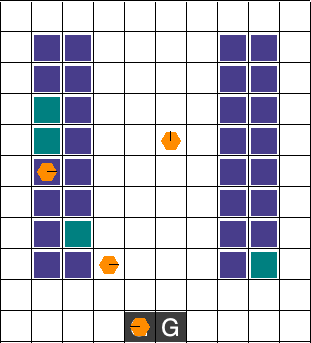

# CS 2860 — Learned Communication Under Teammate Dropout in Cooperative MARL

**Authors:** Praneel Khiantani, Sam Chen | Harvard University, Spring 2026

Can learned inter-agent communication help cooperative agents cope with teammate dropout when liveness signals are delayed? We extend MAPPO on the Robotic Warehouse (RWARE) environment with heartbeat delay, mid-episode dropout, and a discrete communication channel inspired by RIAL.

<p align="center">
  
</p>
<p align="center">
  <em>Trained MAPPO policy on <code>rware-tiny-4ag-v2</code>. Orange = agent, red = agent carrying a shelf, teal = requested shelf, <code>G</code> = delivery goal. Agent&nbsp;0 drops out mid-episode; the remaining team keeps delivering.</em>
</p>

---

## Headline Results

1. **Comm-MAPPO (ungrounded RIAL messages) does not help.** Message entropy stays at 77–87% of uniform-random — the channel never learns meaningful tokens. The hypothesized "dropout rescue" interaction is null across all environments.

2. **GComm-MAPPO (intent-grounded messages) works.** Adding a cross-entropy auxiliary loss that anchors messages to task intent yields significant improvement under targeted dropout (p=0.007, Cohen's d=1.35).

3. **Key insight:** message grounding — not channel capacity — is the bottleneck for communication-aided dropout robustness.

---

## Setup

```bash
cd CS2860
uv sync          # installs all deps (torch, rware, etc.)
```

Requires Python 3.10+ and [uv](https://docs.astral.sh/uv/). CPU only, runs on macOS or Linux.

---

## Quick Start

```bash
# Smoke test (~2 min)
uv run python -m policies.train \
    --env rware-tiny-2ag-v2 --rollout 64 --updates 5 \
    --eval-every 2 --eval-episodes 2 --seed 0
```

See [`REPRODUCE.md`](REPRODUCE.md) for full commands to reproduce every result in the paper.

---

## Project Structure

| Path | What it does |
|------|-------------|
| `policies/train.py` | Main training entry point (MAPPO / Comm-MAPPO / GComm-MAPPO) |
| `policies/mappo/` | MAPPO algorithm: actor, critic, PPO update, rollout buffer |
| `policies/wrappers/` | Heartbeat delay, dropout, message echo, unified env interface |
| `policies/hierarchical/` | Cooperative HRL baseline (SMDP Q-learning) |
| `policies/experiments/` | Automated experiment matrix runner |
| `policies/analysis/` | Aggregation, dashboards, plotting, statistical tests |
| `policies/baselines/` | Non-learning heuristic baseline |
| `matrix_results/` | All committed experiment results and figures |
| `final_paper/` | LaTeX paper (zip and upload to compile) |
| `REPRODUCE.md` | Step-by-step reproduction instructions |

---

## Methods and Regimes

**Methods** — controlled via CLI flags to `policies/train.py`:

| Method | Flag | Description |
|--------|------|-------------|
| MAPPO (no comm) | `--no-comm` | Baseline, no message channel |
| MAPPO + heartbeat | `--no-comm --heartbeat` | Adds delayed liveness features |
| Comm-MAPPO | `--heartbeat` | Adds 8-token RIAL message head |
| GComm-MAPPO | `--heartbeat --message-grounding rware-intent` | Adds intent auxiliary loss |

**Regimes** — controlled via `--dropout` and `--heartbeat-delay`:

| Regime | Dropout? | Heartbeat delay? |
|--------|----------|-----------------|
| baseline | No | No |
| delay-only | No | Yes |
| dropout-only | Yes | No |
| delay-dropout | Yes | Yes |

---

## Running Experiments

```bash
# Preview what would run
uv run python -m policies.experiments.run_rware_matrix --dry-run

# Run a pilot sweep (4 cells × 3 seeds, ~70 min with 3-way parallel)
uv run python -m policies.experiments.run_rware_matrix \
    --methods mappo-heartbeat-only mappo-heartbeat-plus-comm \
    --regimes delay-only delay-dropout \
    --delays 30 --seeds 0 1 2 \
    --updates 1000 --rollout 512 --shape-rewards \
    --dropout-window-start 200 --dropout-window-end 350 \
    --log-dir runs/my_experiment \
    --max-parallel 3 --threads-per-cell 1 \
    --production-eval

# Generate dashboard from results
uv run python -m policies.analysis.pilot_dashboard \
    --log-dir runs/my_experiment \
    --out runs/my_experiment/dashboard.png
```

---

## Viewing Pre-Computed Results

```bash
open matrix_results/exp_pilot_v4_pooled/dashboard.png                                    # Comm-MAPPO curves
open matrix_results/intent_grounded_v1_targeted_analysis/figures/targeted_last5_eval_bar.png  # GComm-MAPPO bar chart
open matrix_results/smoke_small_v1_pooled/diagnostics/per_seed_dynamics.png              # Entropy analysis
```

---

## Further Documentation

| Doc | Contents |
|-----|----------|
| [`REPRODUCE.md`](REPRODUCE.md) | Exact commands to reproduce all paper results |
| [`matrix_results/README.md`](matrix_results/README.md) | Per-experiment provenance and caveats |
| [`policies/hierarchical/README.md`](policies/hierarchical/README.md) | HRL baseline design and paper-to-code mapping |
| `final_paper/main.tex` | The paper itself (IEEE format, 7 pages) |
