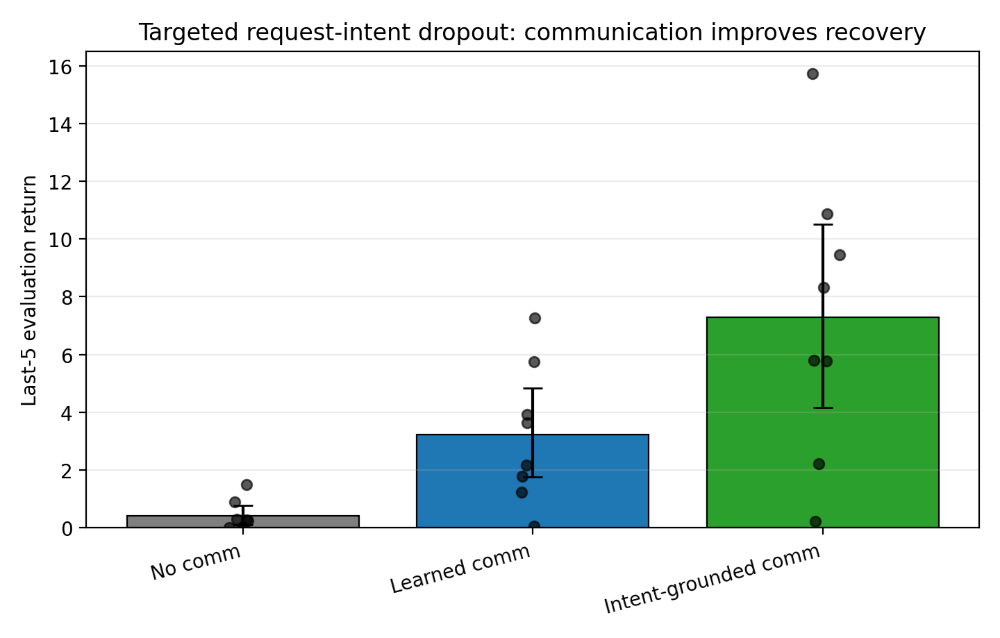
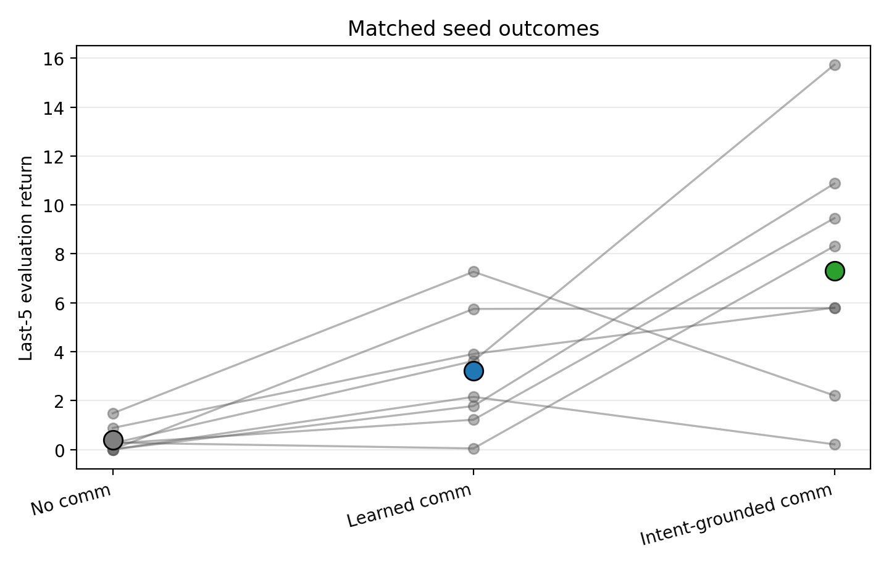
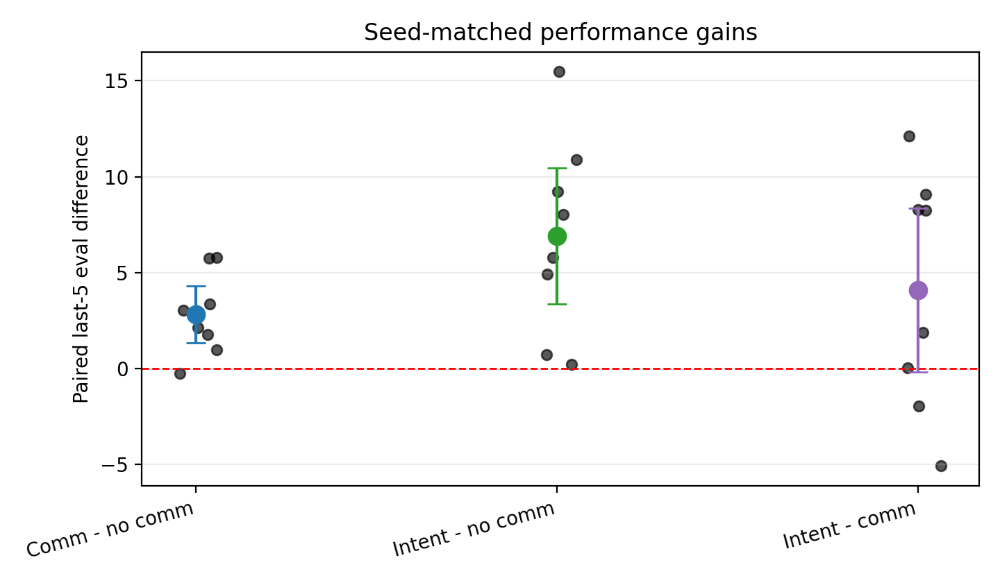
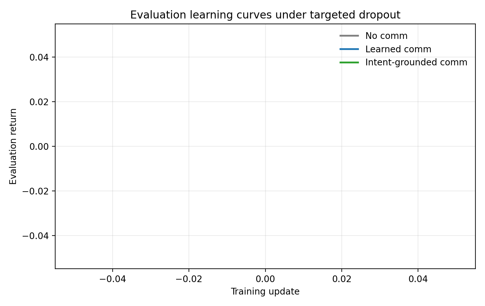
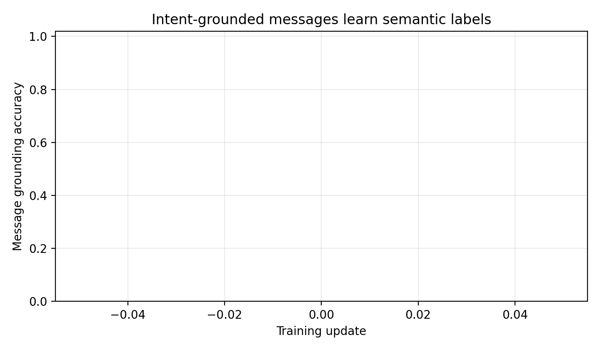
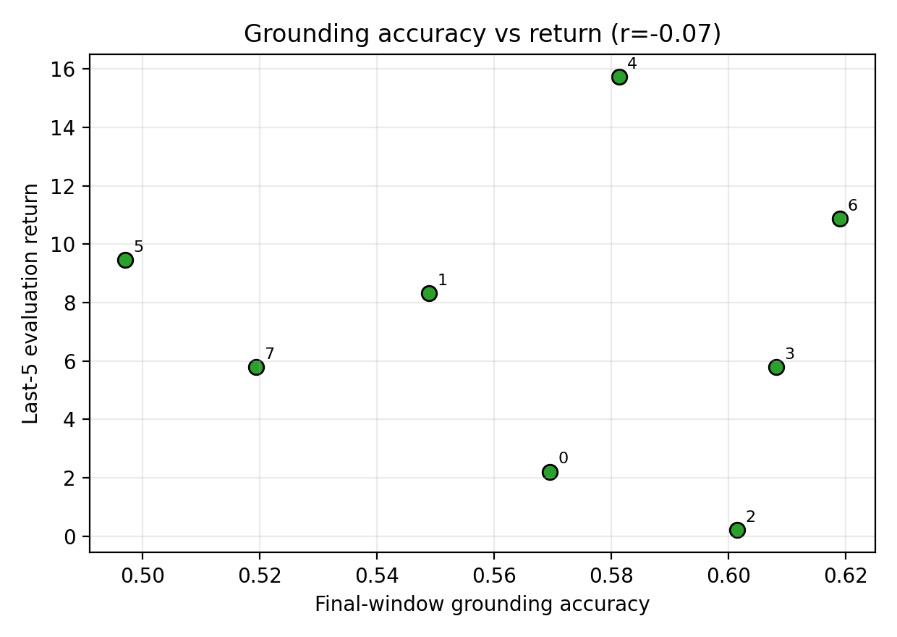

# Paper Analysis: Targeted Request-Intent Dropout

This analysis turns the targeted-dropout run into paper-ready evidence. The core result is that communication becomes useful when the failure removes task-relevant intent: the surviving agent cannot directly observe which request-relevant work was abandoned, but it can condition on stale messages from the failed teammate.

## Experimental Condition

- Environment: `rware-medium-2ag-easy-v2`
- Seeds: `0-7` (`n = 8` matched seeds per method)
- Methods: `mappo-no-comm`, `mappo-comm`, `mappo-intent-aux`
- Dropout: permanent, at episode step `25`
- Target rule: `request-intent` selects the agent carrying a requested shelf, otherwise an agent assigned to a request slot, otherwise the live agent closest to a requested shelf
- Message echo: enabled, so dead agents repeat their last live one-hot message instead of emitting an all-zero death oracle
- Heartbeat: disabled
- Reward shaping: enabled with requested-shelf pickup bonus `0.5`
- Primary metric: per-seed mean of the final 5 evaluation returns

## Main Results

| Method | n | Last-5 Eval Mean | SD | Bootstrap 95% CI | Final Eval Mean |
| --- | ---: | ---: | ---: | ---: | ---: |
| `mappo-no-comm` | 8 | 0.39 | 0.53 | [0.10, 0.76] | 1.01 |
| `mappo-comm` | 8 | 3.22 | 2.41 | [1.74, 4.84] | 5.91 |
| `mappo-intent-aux` | 8 | 7.30 | 4.93 | [4.16, 10.52] | 7.36 |

The result is large enough to be visible at the aggregate and per-seed level. Plain learned communication improves over no communication, and intent-grounded communication has the highest mean return.

## Matched-Seed Statistical Tests

| Comparison | Mean Diff | Bootstrap 95% CI | Cohen dz | Paired t p | Wilcoxon p |
| --- | ---: | ---: | ---: | ---: | ---: |
| `mappo-comm - mappo-no-comm` | +2.82 | [+1.48, +4.22] | 1.32 | 0.0073 | 0.0156 |
| `mappo-intent-aux - mappo-no-comm` | +6.91 | [+3.58, +10.27] | 1.35 | 0.0066 | 0.0078 |
| `mappo-intent-aux - mappo-comm` | +4.08 | [+0.01, +7.99] | 0.66 | 0.1030 | 0.1484 |

The two central paper claims are statistically supported under matched seeds:

1. `mappo-comm` significantly outperforms `mappo-no-comm` (`p = 0.0073`, paired t-test; `p = 0.0156`, Wilcoxon).
2. `mappo-intent-aux` significantly outperforms `mappo-no-comm` (`p = 0.0066`, paired t-test; `p = 0.0078`, Wilcoxon).

Intent grounding also improves the mean over plain communication by +4.08, but this comparison is weaker than the no-communication comparisons and should be framed as suggestive unless replicated with more seeds.

## Per-Seed Outcomes

| Seed | No Comm | Learned Comm | Intent-Grounded | Comm - No | Intent - No | Intent - Comm |
| ---: | ---: | ---: | ---: | ---: | ---: | ---: |
| 0 | 1.48 | 7.27 | 2.21 | +5.79 | +0.73 | -5.06 |
| 1 | 0.28 | 0.04 | 8.32 | -0.24 | +8.04 | +8.27 |
| 2 | 0.00 | 2.15 | 0.21 | +2.15 | +0.21 | -1.94 |
| 3 | 0.00 | 5.75 | 5.78 | +5.75 | +5.78 | +0.04 |
| 4 | 0.25 | 3.62 | 15.73 | +3.36 | +15.48 | +12.12 |
| 5 | 0.24 | 1.22 | 9.46 | +0.97 | +9.21 | +8.24 |
| 6 | 0.00 | 1.78 | 10.87 | +1.78 | +10.87 | +9.10 |
| 7 | 0.88 | 3.91 | 5.80 | +3.03 | +4.92 | +1.89 |

Plain communication beats no communication on 7 of 8 seeds. Intent-grounded communication beats no communication on all 8 seeds. Intent-grounded communication beats plain communication on 5 of 8 seeds.

## Learning Dynamics

The learning curves show the effect is not a single final-evaluation accident: communication methods separate from no communication during training, with intent-grounded communication reaching the strongest final regime.

## Message Grounding Diagnostics

Intent-grounded communication learns the auxiliary semantic labels, with final-window accuracy `mean = 0.57`, `sd = 0.04`. This is not perfect symbolic communication, but it is enough to bias messages toward task-state categories such as availability, carrying a requested shelf, carrying a non-requested shelf, and assignment to request slots.

Across only 8 seeds, grounding accuracy is a noisy predictor of return, so the scatter plot should be treated as diagnostic rather than inferential.

## Paper-Safe Claim

The clean claim is:

> Under targeted request-relevant teammate dropout, communication helps when it
> preserves task intent; intent-grounded communication is the most robust form
> of that signal.

The key qualifier is important. This result does not say communication always helps under arbitrary dropout. It says communication helps when failure creates abandoned-task ambiguity: the failed teammate was carrying, assigned to, or nearest to requested work, and the surviving agent lacks direct access to that teammate's hidden intent. The earlier weaker random/fixed dropout results become useful contrast rather than failure: they show the communication benefit is conditional on the failure mode.

## Randomized Targeted Robustness

Two follow-up runs replaced deterministic target selection with
`request-intent-random`, which samples from the highest non-empty
request-relevance tier rather than always dropping the top-ranked agent.

At `t=25`, intent-grounded communication remained significant against no
communication:

| Method | Last-5 Eval Mean | SD |
| --- | ---: | ---: |
| `mappo-no-comm` | 0.43 | 0.44 |
| `mappo-comm` | 1.72 | 1.95 |
| `mappo-intent-aux` | 5.27 | 2.90 |

`mappo-intent-aux - mappo-no-comm`: mean diff `+4.84`, paired `p=0.0021`,
Wilcoxon `p=0.0078`. Plain learned communication was positive but not
significant (`p=0.1221`).

At `t=50`, the intent-grounded result was stronger and also beat plain learned
communication:

| Method | Last-5 Eval Mean | SD |
| --- | ---: | ---: |
| `mappo-no-comm` | 1.20 | 1.43 |
| `mappo-comm` | 2.36 | 1.90 |
| `mappo-intent-aux` | 8.34 | 2.32 |

`mappo-intent-aux - mappo-no-comm`: mean diff `+7.14`, paired `p=0.00045`,
Wilcoxon `p=0.0078`.

`mappo-intent-aux - mappo-comm`: mean diff `+5.97`, paired `p=0.0046`,
Wilcoxon `p=0.0156`.

This strengthens the final paper framing: deterministic targeted dropout shows
that communication can help under an adversarial request-relevant failure, while
randomized targeted dropout shows that task-grounded messages remain useful
when failures are sampled from request-relevant agents. Unconstrained discrete
communication is less reliable under randomized failures, so the robust claim
should center on intent-grounded communication.

## Recommended Paper Figure Set

Use these figures in the paper or presentation:

1. `figures/targeted_last5_eval_bar.png` for the main result.
2. `figures/targeted_paired_differences.png` to show matched-seed robustness.
3. `figures/targeted_eval_learning_curves.png` to show training dynamics.
4. `figures/targeted_message_grounding_accuracy.png` if discussing intent grounding.

## Remaining Follow-Up

The result is now strong enough for the course paper. The main remaining work is
paper drafting, final figure selection, and a concise presentation narrative.
